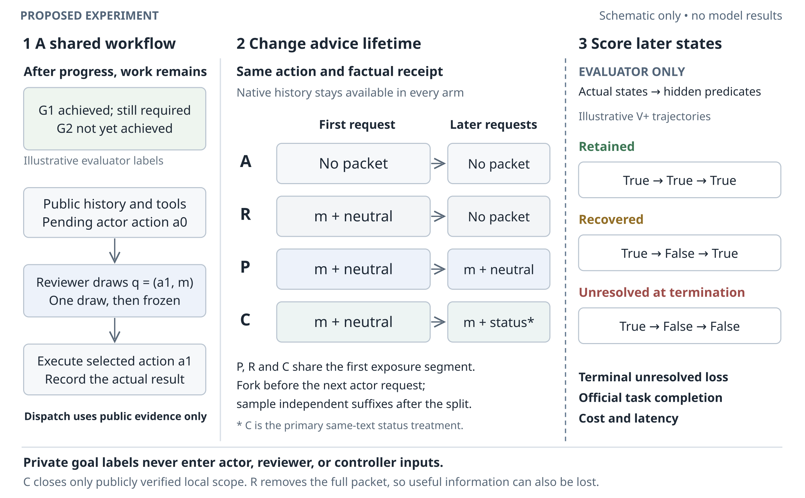

# Reviewer advice lifetimes in multi-turn agents

An **experiment-preparation release**, with a CPU-local runner and mock-tested
integration of the pinned official τ²-bench Telecom environment. **Formal model
experiments run: zero.** No efficacy or causal improvement is claimed.

The primary proposed comparison is **C versus P**: the same reviewer text,
selected action, factual receipt and shared first exposure; only the later
completion-scope status header changes. R removes the entire packet after one
valid actor response. Earlier persistent feedback is called P0.



## Run locally

Tested on Linux with Python 3.12. Python 3.12–3.13 is the upstream-supported
range; Windows is not supported by these POSIX launchers. No GPU is needed.
Use a checkout and an existing official installation of `uv` on PATH. Setup
uses only the official PyPI lock and hash-pinned wheels; it does not run models.

```sh
python3 tools/public_manifest.py --check
python3 code_inputs/reviewer_pilot/install_locked.py
python3 code_inputs/reviewer_pilot/install_locked.py gap
python3 -m local_experiments validate --config configs/wire-smoke.json
python3 -m local_experiments run --config configs/wire-smoke.json --output-dir results/wire-smoke
python3 -m local_experiments analyze --input-dir results/wire-smoke --output-dir results/wire-smoke-analysis
python3 -m local_experiments export --input-dir results/wire-smoke-analysis --output-dir exports/wire-smoke
```

Output directories must be new. Omitting `--mode` selects `dry-run`: no key or
`.env` is read, no API client is initialized, and guarded mock responses drive
real official tools and evaluation. Fixture analyses report model outcomes as
`not_run`, not effect estimates. `validate` checks configuration, not provider
availability or scientific readiness. This is a run-from-checkout project;
packaging a self-contained wheel is not supported.

Run the tests and regenerate all legacy development fixtures:

```sh
python3 -m unittest discover -s tests -v
python3 tools/offline_checks.py
```

## User-operated live runs

The separate HTTPS Chat Completions transport is real code, tested with mocked
HTTP responses and virtual credentials. It has not been tested against a real
provider in repository preparation. Set the five shell variables named in
[.env.example](.env.example) locally using your normal secret-management method.
No `.env` file is automatically loaded; never put a key in JSON or a command
argument. Endpoint and model selection are entirely yours.

```sh
python3 -m local_experiments run --config configs/wire-smoke.json --mode live --output-dir results/live-smoke-001
python3 -m local_experiments run --config configs/natural-pilot.json --mode live --output-dir results/live-pilot-001
```

Only the explicit `--mode live` flag enables credential reading and model
requests. There is no additional assistant budget approval. Configure request,
step/error, retry, timeout and output-size limits in the JSON. There is no
mandatory total token budget. Token usage is recorded when supplied; prices
and currency costs remain unknown. Monetary caps are explicitly unsupported.
TLS verification stays enabled; redirects are rejected. See the
[local runbook](docs/LOCAL_RUNBOOK.md) before collecting live data.

## Implemented scope and limits

The v2 runner supports official Telecom READ tools and bounded roaming WRITEs,
multiple roots/tasks, all eight arms, independent repeated suffixes, native model
failure scoring, frozen-manifest confirmation, request-level cost attribution
and explicit interrupted-run recovery. WRITE smoke changes actual official
state. All bundled observations remain development fixtures.

| Arm | Behavior |
| --- | --- |
| B_bare | Original native representation; manuscript B_native |
| B | Original action with factual controller receipt |
| S | One actor-model self-reconsideration; selected action, no packet |
| A | Reviewer-selected action and receipt, no packet |
| P0 | Unwrapped persistent packet |
| P | Exact packet plus neutral status sentence |
| R | Shared first exposure, then packet/header removed; receipt retained |
| C | Same packet; only later public completion-status header changes |

`wire-smoke`, `natural-pilot` and `confirmatory-roots` use the implemented root
runner. The confirmation template initially rejects because its sample, margins,
models and freeze are unset and its default tasks are exposed. The
[runbook](docs/LOCAL_RUNBOOK.md) explains how to freeze a separately selected
unseen sample and execute it locally. Episode-start `end-to-end` is a separate
unimplemented extension.

The study scope is fixed-goal tasks, with explicit independent-unit assumptions;
dynamic user goal changes and arbitrary mutations are unsupported. Public call
closure does not prove repair. See [capabilities](docs/CAPABILITIES.md) and the
[v2 operational protocol](docs/protocol/local_runner_v2.md) for failure,
missingness, recovery and statistical limits. All seven original witnesses plus
the non-idempotent restore regression task are exposed development material.
No real model run was performed during preparation.

## Research and reproducibility

- [Final pre-experiment manuscript (DOCX)](paper/reviewer_advice_lifetimes_preexperiment.docx), [text](paper/manuscript.txt), [SVG](paper/reviewer_advice_overview.svg)
- [Current scientific protocol](docs/protocol/current_protocol.md) and [experiment plan](docs/planning/EXPERIMENT_PLAN.md)
- [Literature audit](docs/research/related_work_audit.md), [prior art](docs/research/correction_prior_art.md), [research history and decisions](docs/history/RESEARCH_HISTORY.md)
- [Actual validation receipt](docs/validation/current_release.json), [integration migration](docs/reproducibility/public_integration.md)
- [Licensing and data acquisition](docs/reproducibility/licenses.md), [results return/privacy](docs/planning/RESULTS_RETURN.md)

The exact 281-file official source/data allowlist is vendored under
`code_inputs/reviewer_pilot/upstream/`, pinned to
`4ce7c0397c1eb65c9bbe59aeacfe1ca44a1cd699`. Its MIT notices are preserved.
Original research, figures and code have **no specified license grant**; do not
apply the upstream MIT license to original work. Dependencies retain their own
licenses. Excluded historical external datasets require separate license review.

Raw local responses, checkpoints, installation logs and runtime results remain
ignored and private. Export rebuilds a small typed aggregate allowlist locally;
it never uploads, pushes, or publishes. No raw user conversations or private
runtime snapshots are included in this release.
